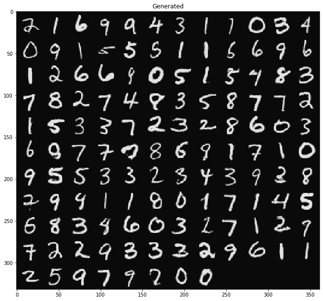

# StyleGAN2 with Pytorch

Simple implementation of **Analyzing and Improving the Image Quality of StyleGAN** ([http://arxiv.org/abs/1912.04958](http://arxiv.org/abs/1912.04958)).

The project currently contains building blocks for GAN. You need to implement your own network for your purposes.

I would appreciate help with testing.

### Example on Mnist:

### TODO

- [ ] Building net architecture
- [ ] Training procedure
